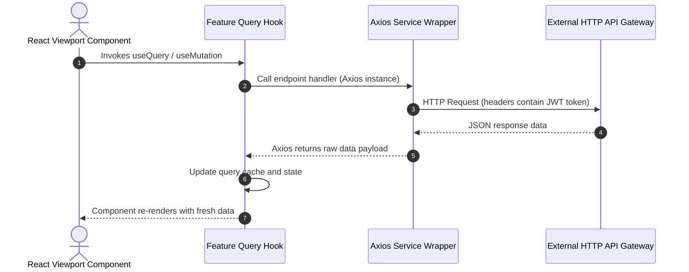
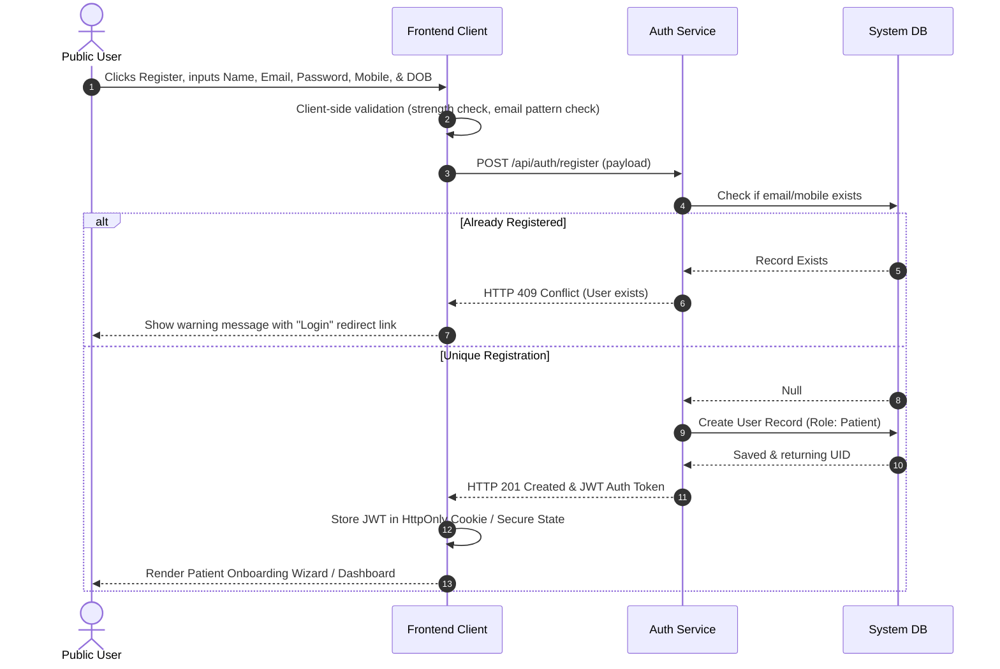
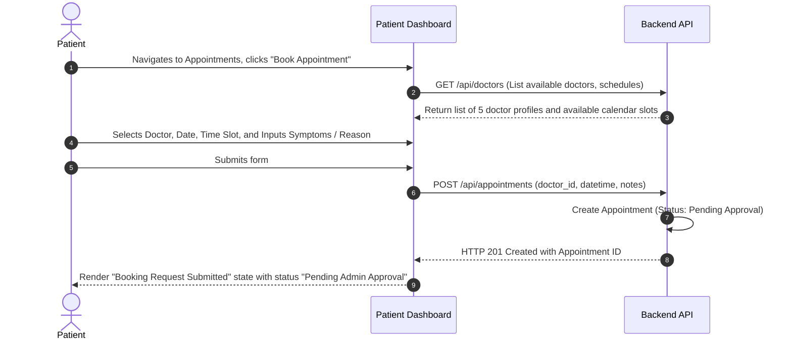
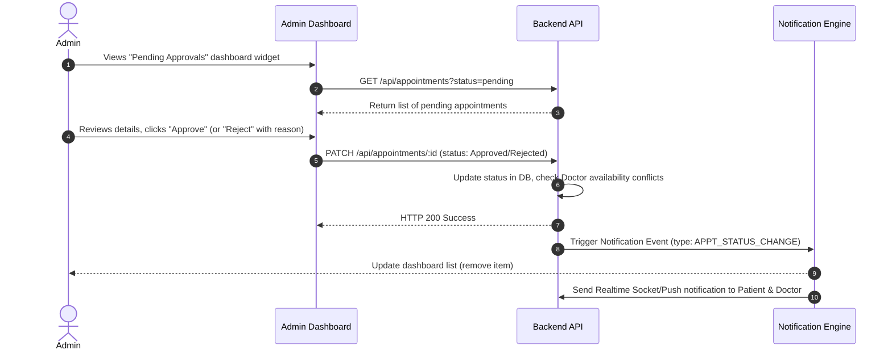
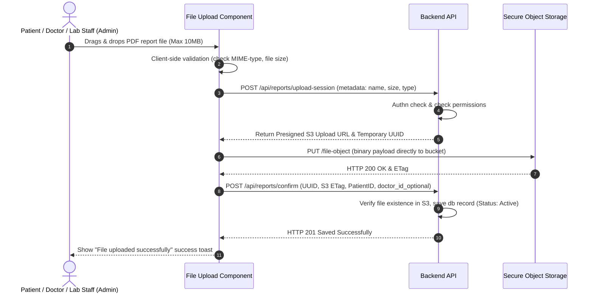
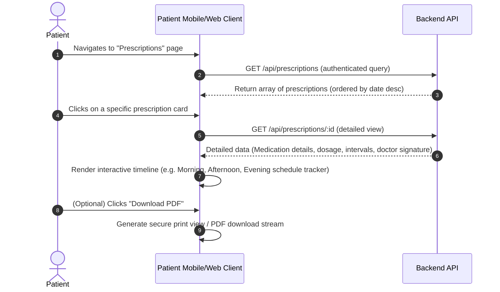
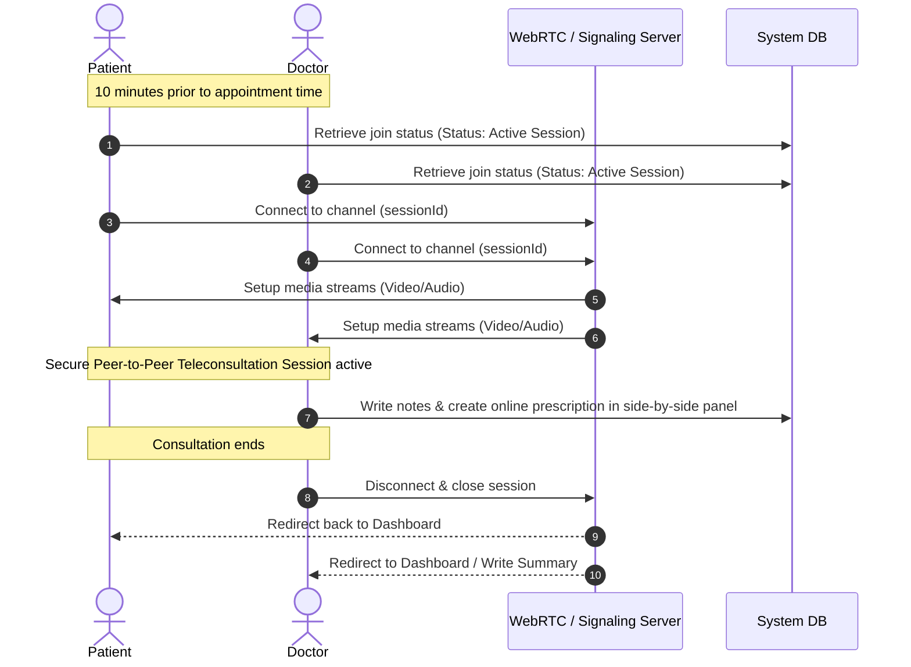

[drcare_build_roadmap.md](https://github.com/user-attachments/files/29155024/drcare_build_roadmap.md)
# drcare Build Roadmap Bible

This document outlines the detailed build roadmap, package dependencies, milestones, and mitigation plans for the **drcare** frontend.

---

## 1. Project Construction Build Order

To ensure parallel progress without dependency bottlenecks, the codebase will be built using the following sequence:

```text
┌────────────────────────────────────────────────────────┐
│ Phase 1: Bootstrapping & Design Token Setup            │
│ - Vite React-TS Project Initialization                 │
│ - Tailwind theme variables integration                  │
│ - Install Core: React Router, Zustand, TanStack Query  │
└───────────────────────────┬────────────────────────────┘
                            │ (depends on)
                            ▼
┌────────────────────────────────────────────────────────┐
│ Phase 2: Core Atoms, Molecules & Layouts Construction  │
│ - UI elements (Button, Input, FormField, Badge, Card)  │
│ - Master Shell layouts (Public, Dashboard, Split Workspace)│
│ - Navigation controls (NavigationBar, Sidebar, Topbar)   │
└───────────────────────────┬────────────────────────────┘
                            │ (depends on)
                            ▼
┌────────────────────────────────────────────────────────┐
│ Phase 3: Client Global Stores & Auth Flow              │
│ - Setup useAuthStore & useUIStore (Zustand)            │
│ - GuestGuard & RoleGuard layout protection wrappers    │
│ - Login UI (PUB-004) & Registration Wizard (PUB-005)   │
└───────────────────────────┬────────────────────────────┘
                            │ (depends on)
                            ▼
┌────────────────────────────────────────────────────────┐
│ Phase 4: Core Patient & Doctor Workflows               │
│ - Booking Forms (PAT-004) & Patient Appts (PAT-003)    │
│ - EHR Timeline detail views (DOC-003)                  │
│ - Digital Prescription composer creator table (DOC-004) │
└───────────────────────────┬────────────────────────────┘
                            │ (depends on)
                            ▼
┌────────────────────────────────────────────────────────┐
│ Phase 5: Telehealth Workspace & Admin Settings         │
│ - WebRTC video client terminal rooms (PAT-009/DOC-006) │
│ - Appointments Approvals (ADM-004) & Pricing (ADM-005) │
│ - Audits log grids & dataset CSV exports               │
└────────────────────────────────────────────────────────┘
```

---

## 2. Core Dependencies & Libraries

The system relies on the following React, styling, and validation packages:

*   **Runtime Framework**: React 18, TypeScript, Vite.
*   **Routing System**: `react-router-dom` (Version 6.x).
*   **Styling Engine**: Tailwind CSS, `class-variance-authority` (CVA), `tailwind-merge`, `clsx`.
*   **Shadcn UI Components Foundation**: Radix UI primitives (`@radix-ui/*`), Lucide React.
*   **State & Caching Layer**: `zustand`, `@tanstack/react-query` (React Query v5).
*   **Form & Validation Engines**: `react-hook-form`, `zod`, `@hookform/resolvers`.
*   **WebRTC Client Support**: Standard HTML5 MediaDevices APIs.

---

## 3. Milestones Checklist

*   **[ ] Milestone 1: Foundations Operational** (Target: End of Sprint 1)
    *   Folder layout initialized, Tailwind HSL design variables compiled, and routing structures configured.
*   **[ ] Milestone 2: Authentication & Guarded Redirection Verified** (Target: End of Sprint 2)
    *   Mock role switching active, Login pages working, and layout guards redirecting role mismatches.
*   **[ ] Milestone 3: Scheduling & EHR Composer Functional** (Target: End of Sprint 4)
    *   Appointment booking forms complete, Admin approval queues updating, and Doctor EHR composer signing.
*   **[ ] Milestone 4: Telehealth video calling & Data Exporters Live** (Target: End of Sprint 5)
    *   WebRTC workspaces active, and CSV compliance audits log datasets download correctly.

---

## 4. Technical Risk Mitigation Plan

1.  **Risk: WebRTC Device Access Failures**
    *   *Mitigation*: Implement dynamic pre-flight checks inside `useTeleconsultationStore` that verify camera/microphone availability before rendering call viewports, and display user instructions if permissions are blocked.
2.  **Risk: Large Console Grid Slowdowns**
    *   *Mitigation*: Deploy virtualization libraries (`@tanstack/react-virtual`) for the audit trail grids to ensure only visible rows are parsed in the DOM, maintaining standard page performance.
3.  **Risk: Double Booking Conflicts**
    *   *Mitigation*: Implement optimistic lock validations in the appointment service layer. Check calendar schedules before confirming submissions and notify the patient immediately if a conflict is detected.

  
  # drcare Design System Bible

This document contains design tokens, layout parameters, and reusable component configurations for the **drcare** platform.

---

## 1. Design Tokens & Color Palettes

### Semantic Color Scale (HSL)

| Token Name | Light Value | Dark Value | Mapped Usage |
| :--- | :--- | :--- | :--- |
| `color/primary` | `hsl(158, 82%, 35%)` | `hsl(158, 70%, 45%)` | Brand Emerald, CTA background accents |
| `color/secondary` | `hsl(187, 85%, 28%)` | `hsl(187, 75%, 38%)` | Header blocks, deep navigation highlights |
| `color/bg-canvas` | `hsl(210, 40%, 98%)` | `hsl(215, 25%, 12%)` | Body canvas background container |
| `color/card` | `hsl(0, 0%, 100%)` | `hsl(217, 19%, 17%)` | Widgets, dialog forms wrappers |
| `color/border` | `hsl(214, 32%, 91%)` | `hsl(217, 19%, 27%)` | Layout dividers, inputs borders |
| `color/text` | `hsl(215, 25%, 12%)` | `hsl(210, 40%, 98%)` | Primary labels, paragraphs copy |
| `color/text-muted` | `hsl(215, 16%, 47%)` | `hsl(215, 16%, 65%)` | Caption notes, secondary details |
| `color/success` | `hsl(142, 72%, 29%)` | `hsl(142, 69%, 45%)` | Approved states, success toast alerts |
| `color/warning` | `hsl(38, 92%, 50%)` | `hsl(38, 92%, 50%)` | Pending approvals highlights |
| `color/destructive` | `hsl(346, 84%, 49%)` | `hsl(346, 84%, 60%)` | Decline button triggers, error panels |

---

## 2. Typography

*   **UI Typography**: `Inter` (sans-serif) for tabular values, forms, navigation lists, and body copy.
*   **Header Typography**: `Outfit` (sans-serif) for main viewport titles, marketing headings, and core metric card values.

### Font Scale
*   `type/display-1`: `36px` / Line Height: `44px` / Weight: `800` (Hero sections)
*   `type/h1`: `28px` / Line Height: `36px` / Weight: `700` (Main portal views)
*   `type/h2`: `22px` / Line Height: `28px` / Weight: `600` (Widget headers)
*   `type/subtitle`: `16px` / Line Height: `22px` / Weight: `500` (EHR timeline labels)
*   `type/body`: `14px` / Line Height: `20px` / Weight: `400` (Defaults)
*   `type/caption`: `12px` / Line Height: `16px` / Weight: `400` (Timestamps, file size details)

---

## 3. Layout Grid & Spacing Scale (8pt System)

*   `spacing-1`: `4px` (`0.25rem`) — Badge internal padding.
*   `spacing-2`: `8px` (`0.5rem`) — Gaps between text headings.
*   `spacing-3`: `12px` (`0.75rem`) — Form inputs vertical spacing.
*   `spacing-4`: `16px` (`1rem`) — Card borders inner margins.
*   `spacing-6`: `24px` (`1.5rem`) — Layout gutters.
*   `spacing-8`: `32px` (`2rem`) — Major widget splits separation margins.
*   **Border Radius**: `sm: 4px` (Badges), `md: 8px` (Inputs, Buttons), `lg: 12px` (Cards), `xl: 16px` (Modal wrappers).
*   **Elevation Shadows**: `sm` (Input focus outline), `md` (Dashboard widgets), `lg` (Drop menus, modals).

---

## 4. Reusable Layouts Blueprint

### A. PublicLayout
Header navigation navigation links on top, main viewport content centered inside `max-w-7xl` container limits, static footer panel on bottom.

### B. DashboardLayout
Role-specific Sidebar navigation panel on left. Sidebar width collapses to 70px icon-only representation if toggle state is triggered. Scrollable right-side viewport panel with fixed Topbar header.

### C. WorkspaceSplitLayout
Designed for teleconsultations. Fixed horizontal split view (left side: remote/local WebRTC video stream; right side: active context tabs including EHR timeline, Chat stream logs, and live Prescription composer).

---

## 5. Components Specifications (Atomic Catalog)

*   **Buttons (Atoms)**: Standard HTML wrappers utilizing CVA for variants: Primary, Secondary, Outline, Ghost, and Destructive.
*   **FormFields (Molecules)**: Assembled label, input element wrapper, validation indicators, and validation message labels.
*   **MetricCards (Molecules)**: KPI widget components mapping metric title, values, change indicators, and dynamic action parameters.
*   **TimelineNodes (Molecules)**: Chronological EHR node containing visual status indicator dots and download actions.
*   **FileDropAreas (Molecules)**: Dashed upload drop zone with progress indicators.
*   **Sidebars & Topbars (Organisms)**: Menu blocks and dashboard headers supporting role routing, email profiles, and notification drawers.
*   **VideoRooms (Organisms)**: Fullscreen video feeds using WebRTC tracks with floating overlay control bars.

[drcare_design_system.md](https://github.com/user-attachments/files/29155027/drcare_design_system.md)


[drcare_frontend_architecture.md](https://github.com/user-attachments/files/29155032/drcare_frontend_architecture.md)# drcare Frontend Architecture Bible

This document contains folder layouts, routing paths, data flows, and state management strategies for the **drcare** React application.

---

## 1. Project Folder Structure

```text
src/
├── assets/                  # Custom CSS styles, corporate icons, SVGs
├── components/              # Shared UI components catalog
│   ├── ui/                  # Shadcn UI primitives (Buttons, Tables, Calendars)
│   ├── atoms/               # Custom atoms (Badge, Tooltip, Avatar, Spinner)
│   ├── molecules/           # Custom molecules (FormField, MetricCard, DatePicker)
│   └── organisms/           # Custom organisms (Sidebar, Topbar, VideoRoom)
├── config/                  # Envs, base API configuration urls
├── features/                # Domain-driven features modules
│   ├── auth/                # Auth context, Login/Register forms
│   ├── appointments/        # Booking calendars, approvals tables
│   ├── reports/             # Reports center, file progress items
│   ├── prescriptions/       # Doctor composer grid, timeline records
│   └── teleconsultation/    # WebRTC signals, video layout elements
├── hooks/                   # Custom utility hooks (useMediaQuery, useToast)
├── layouts/                 # Screen layouts shells (Public, Dashboard, Split)
├── routes/                  # Guards configuration, path directories
├── services/                # Axios API call engines
├── store/                   # Zustand stores (useAuthStore, useUIStore)
├── types/                   # Unified TS declarations
└── utils/                   # Data parsing helpers, file checking utils
```

---

## 2. Protected Routing Config

*   **Public Route**: Accessible without token. Includes Landing (`/`), Charges (`/charges`), services (`/services`), Request Appt (`/request-appointment`), and Auth routes (`/auth/*`).
*   **Guarded Routes**: Handled by custom React wrappers:
    *   `GuestGuard`: Directs authenticated profiles away from auth viewports to their dashboards.
    *   `RoleGuard`: Intercepts route load events. Compares user role with `allowedRoles` array. If mismatch occurs, displays warning toast and redirects to base directories.

### Protected Directory Routes:
*   **Patient**: `/patient/dashboard`, `/patient/profile`, `/patient/appointments`, `/patient/appointments/new`, `/patient/reports`, `/patient/reports/upload`, `/patient/prescriptions`, `/patient/billing`, `/patient/teleconsultation/:sessionId`, `/patient/care-instructions`.
*   **Doctor**: `/doctor/dashboard`, `/doctor/patients`, `/doctor/patients/:patientId`, `/doctor/patients/:patientId/prescribe`, `/doctor/teleconsultation/:sessionId`, `/doctor/exports`.
*   **Admin**: `/admin/dashboard`, `/admin/users`, `/admin/doctors`, `/admin/appointments`, `/admin/charges`, `/admin/reports`, `/admin/audit-logs`, `/admin/exports`.

---

## 3. State Management Strategy

### Zustand (Client UI & Session States)
1. **`useAuthStore`**: Controls session state, stores active JWT tokens, parses roles, and manages auth methods.
2. **`useUIStore`**: Manages sidebar toggles, open notification drawers, alerts display, and theme selections.
3. **`useTeleconsultationStore`**: Manages WebRTC session states, including microphone mute state, local/remote camera tracks state, signaling connection state, and active chat feeds.

### TanStack Query (Server State Cache)[product_architecture_and_design_system.md](https://github.com/user-attachments/files/29155036/product_architecture_and_design_system.md)

*   **Cache Invalidation**: On successful mutation, queries are invalidated to trigger re-fetches (e.g. invalidating `['appointments']` on Admin approval updates).
*   **Query Key Pattern**: Organized by query context: `['appointments', role, status]`, `['patient-ehr', patientId]`.

---

## 4. API Data Flow


*   **Axios Config**: Configured with request interceptors to append `Authorization: Bearer <token>` to requests.
*   **Validation**: Responses are validated against Zod schemas on the API caller layer before caching.
# drcare: Healthcare Information, Patient Management, and Telemedicine Platform
## Product Architecture & UX Specification

This document contains the complete design and technical architecture for **drcare**, a comprehensive healthcare platform supporting Public Users, Patients, Doctors, and Administrators.

---

## Phase 1: Sitemap & Information Architecture

The platform's pages are partitioned by user role and access control. Below is the directory sitemap mapping user entry points, secondary pages, and administrative controls.

```mermaid
graph TD
    %% Public Sitemap
    PublicRoot["/ (Public Portal)"]
    PublicRoot --> Home["/home (Healthcare & Services Info)"]
    PublicRoot --> Charges["/charges (Service & Billing Info)"]
    PublicRoot --> Auth["/auth (Login & Registration)"]
    PublicRoot --> ReqAppt["/request-appointment (Public Booking Form)"]
    
    %% Patient Sitemap
    PatientRoot["/patient (Patient Portal - Protected)"]
    PatientRoot --> PatDash["/patient/dashboard"]
    PatientRoot --> PatProfile["/patient/profile"]
    PatientRoot --> PatAppts["/patient/appointments"]
    PatAppts --> PatBook["/patient/appointments/new"]
    PatientRoot --> PatReports["/patient/reports"]
    PatReports --> PatUpload["/patient/reports/upload"]
    PatientRoot --> PatPrescriptions["/patient/prescriptions"]
    PatientRoot --> PatBilling["/patient/billing"]
    PatientRoot --> PatTele["/patient/teleconsultation/:sessionId"]
    PatientRoot --> PatCare["/patient/care-instructions"]

    %% Doctor Sitemap
    DoctorRoot["/doctor (Doctor Portal - Protected)"]
    DoctorRoot --> DocDash["/doctor/dashboard"]
    DoctorRoot --> DocPatients["/doctor/patients"]
    DocPatients --> DocPatDetail["/doctor/patients/:patientId"]
    DocPatDetail --> DocPrescribe["/doctor/patients/:patientId/prescribe"]
    DocPatDetail --> DocReportUpload["/doctor/patients/:patientId/upload-report"]
    DoctorRoot --> DocTele["/doctor/teleconsultation/:sessionId"]
    DoctorRoot --> DocExport["/doctor/exports"]

    %% Admin Sitemap
    AdminRoot["/admin (Admin Portal - Protected)"]
    AdminRoot --> AdmDash["/admin/dashboard"]
    AdminRoot --> AdmUsers["/admin/users"]
    AdminRoot --> AdmDoctors["/admin/doctors"]
    AdminRoot --> AdmAppts["/admin/appointments"]
    AdminRoot --> AdmCharges["/admin/charges"]
    AdminRoot --> AdmReports["/admin/reports"]
    AdminRoot --> AdmAudit["/admin/audit-logs"]
    AdminRoot --> AdmExport["/admin/exports"]
```



### Route Access Control Matrix
| Path Pattern | Public User | Patient | Doctor | Admin | Description |
| :--- | :---: | :---: | :---: | :---: | :--- |
| `/` | ✓ | ✓ | ✓ | ✓ | Splash landing page & service directories |
| `/charges` | ✓ | ✓ | ✓ | ✓ | Cost transparency grid of hospital services |
| `/request-appointment` | ✓ | ✓ | - | - | Initial appointment request form (anonymous) |
| `/auth/*` | ✓ | - | - | - | Registration, login, and recovery pages |
| `/patient/*` | - | ✓ | - | - | Protected Patient workspace |
| `/doctor/*` | - | - | ✓ | - | Protected Doctor workspace (restricted to ~5 doctors) |
| `/admin/*` | - | - | - | ✓ | Protected Admin configuration & auditing workspace |

---

## Phase 2: Core User Flows

The following flow diagrams detail the sequential interaction models for the system's core user activities.

### 1. User Registration Flow


### 2. Patient Appointment Booking Flow


### 3. Admin Appointment Approval Flow


### 4. Report Upload Flow (Patient & Doctor)


### 5. Prescription Viewing Flow (Patient)


### 6. Teleconsultation Flow


---

## Phase 3: Screen Inventory Grouped by Role

Below is the exhaustive inventory of all screens required for the application.

### 1. Public Portal (Anonymous Access)
*   **PUB-001: Landing Page (`/`)**: Main marketing page. Showcases company vision, highlights primary core services, provides links to find doctors, and displays a prominent Call-to-Action (CTA) to Register or Request an Appointment.
*   **PUB-002: Service Information Directory (`/services`)**: Filterable grid displaying available treatments, diagnostics, check-up packages, and operating hours.
*   **PUB-003: Charges Directory (`/charges`)**: Open-access table list showing pricing transparency for medical tests, doctor consultations, room charges, and diagnostic tools. Includes simple search/filter controls.
*   **PUB-004: Sign-In Screen (`/auth/login`)**: Secure login page supporting multi-role auth redirection.
*   **PUB-005: Registration Screen (`/auth/register`)**: Sign-up form mapping demographics, contact info, and basic terms agreements.
*   **PUB-006: Public Appointment Request Screen (`/request-appointment`)**: Simple multi-step booking wizard for non-registered users. Submits requests directly to the Administrator's queue for registration validation and scheduling.

### 2. Patient Portal (Authenticated Patient Role)
*   **PAT-001: Patient Dashboard (`/patient/dashboard`)**: Centralized workspace showing next appointment reminder, quick actions, diet/care widget, prescription checklist, and recent billing summaries.
*   **PAT-002: Profile Management (`/patient/profile`)**: Manage personal details, emergency contacts, insurance files, and login credentials.
*   **PAT-003: Appointment History & Scheduling (`/patient/appointments`)**: Listing of past and future appointments. Contains buttons to reschedule, request cancellation, or start teleconsultations.
*   **PAT-004: Interactive Booking Form (`/patient/appointments/new`)**: In-portal appointment wizard. Shows live calendar availabilities of the 5 doctors and slots selection.
*   **PAT-005: Medical Reports Center (`/patient/reports`)**: Repository containing doctor-uploaded lab results and patient self-uploaded histories.
*   **PAT-006: Report Upload Portal (`/patient/reports/upload`)**: Drag-and-drop file interface for uploading external medical records.
*   **PAT-007: Prescriptions Tracker (`/patient/prescriptions`)**: Chronological view of active and historical prescriptions, displaying dosage details and downloadable pdf invoices.
*   **PAT-008: Billing & Invoices Dashboard (`/patient/billing`)**: Statement listing outstanding dues, payment history, and receipt downloads.
*   **PAT-009: Teleconsultation Client (`/patient/teleconsultation/:sessionId`)**: WebRTC video chat room interface with parallel text chat and a side panel showing the appointment details.
*   **PAT-010: Diet & Care Instructions Feed (`/patient/care-instructions`)**: Customized feed of physician-assigned dietary guidelines, exercise routines, and wellness tips.

### 3. Doctor Portal (Authenticated Doctor Role)
*   **DOC-001: Doctor Dashboard (`/doctor/dashboard`)**: Summary view showing today's schedule, quick metrics (total patients, pending follow-ups), patient waiting room indicator, and notifications.
*   **DOC-002: Patient Directory (`/doctor/patients`)**: List of patients currently registered in the platform, searchable by name, age, condition, and last checkup date.
*   **DOC-003: Patient Profile Detail View (`/doctor/patients/:patientId`)**: Electronic Health Record (EHR) view containing a timeline of medical histories, reports, and previous prescriptions.
*   **DOC-004: Digital Prescription Creator (`/doctor/patients/:patientId/prescribe`)**: Multi-row form to input medication names, frequency, durations, special instructions, and digital signature.
*   **DOC-005: Report Uploader (`/doctor/patients/:patientId/upload-report`)**: Fast interface to tag lab files, select category (blood work, imaging, etc.), and publish to patient view.
*   **DOC-006: Teleconsultation Workspace (`/doctor/teleconsultation/:sessionId`)**: Dual-pane workspace showing the WebRTC video terminal on the left and the patient's record / prescription form on the right.
*   **DOC-007: Dataset Export Workspace (`/doctor/exports`)**: Export workspace allowing download of patient statistics, consultation histories, and prescription counts in CSV format (aligned for research or import preparations).

### 4. Admin Portal (Authenticated Administrator Role)
*   **ADM-001: Admin Dashboard (`/admin/dashboard`)**: Overall health dashboard showing appointment volumes, total active users, registered doctors, system throughput, and database logs.
*   **ADM-002: User Management (`/admin/users`)**: Search, edit details, assign permissions, disable/activate accounts, and verify emails for all users.
*   **ADM-003: Doctor Management (`/admin/doctors`)**: Specialized panel to configure the accounts, specialties, schedules, video-room linkages, and consulting charges of the 5 doctors.
*   **ADM-004: Appointment Approvals Center (`/admin/appointments`)**: Table of pending requests. Actionable buttons to approve, reschedule, or cancel with notes.
*   **ADM-005: Charges Configuration Panel (`/admin/charges`)**: Dynamic pricing table dashboard where hospital services, tests, and consultation fees can be updated in real-time.
*   **ADM-006: Global Report Repository (`/admin/reports`)**: Central management panel for audit checks of uploaded patient reports, including options to flag or delete inappropriate files.
*   **ADM-007: Audit Logs Viewer (`/admin/audit-logs`)**: Immutable logging feed tracking critical activities (e.g. user deletions, charge overrides, admin logins) with IP, user, and timestamp data.
*   **ADM-008: Admin Export Center (`/admin/exports`)**: High-privilege dashboard to export anonymized or structured clinical datasets for analytical tools.

---

## Phase 4: Unified Design System

To ensure professional visual quality and accessible navigation, this design system uses modern web styling standards with a primary healthcare motif.

### 1. Color Palette (Semantic HSL Scale)
We use a premium, slate-and-teal medical color palette.

| Semantic Type | Name | Light Mode Value | Dark Mode Value | Usage |
| :--- | :--- | :--- | :--- | :--- |
| **Primary** | Emerald Green | `hsl(158, 82%, 35%)` | `hsl(158, 70%, 45%)` | Brand accents, key actions, healing themes |
| **Secondary** | Deep Teal | `hsl(187, 85%, 28%)` | `hsl(187, 75%, 38%)` | Headers, secondary accents, nav bars |
| **Neutral Dark** | Slate 900 | `hsl(215, 25%, 12%)` | `hsl(210, 40%, 98%)` | Body copy, primary text |
| **Neutral Light** | Slate 50 | `hsl(210, 40%, 98%)` | `hsl(215, 25%, 12%)` | Main application background canvas |
| **Border / Card** | Slate 200 | `hsl(214, 32%, 91%)` | `hsl(217, 19%, 27%)` | Subtle dividing lines, container shapes |
| **Success** | Forest Green | `hsl(142, 72%, 29%)` | `hsl(142, 69%, 45%)` | Active indicators, approved states, success toasts |
| **Warning** | Amber Yellow | `hsl(38, 92%, 50%)` | `hsl(38, 92%, 50%)` | Pending approvals, warnings |
| **Destructive** | Crimson Red | `hsl(346, 84%, 49%)` | `hsl(346, 84%, 60%)` | Cancellation buttons, errors, alerts |

### 2. Typography Specification
*   **Primary Typeface**: `Inter` (Google Fonts) for UI elements, labels, and statistics.
*   **Secondary Typeface**: `Outfit` (Google Fonts) for page titles, headings, and branding elements.
*   **Scale Hierarchy**:
    *   `Display 1`: `36px` / `line-height: 1.2` / `weight: 800` (Hero sections)
    *   `Heading 1`: `28px` / `line-height: 1.3` / `weight: 700` (Main page titles)
    *   `Heading 2`: `22px` / `line-height: 1.3` / `weight: 600` (Section headings)
    *   `Subtitle`: `16px` / `line-height: 1.4` / `weight: 500` (Metadata, card headers)
    *   `Body`: `14px` / `line-height: 1.5` / `weight: 400` (Default text content)
    *   `Caption / Small`: `12px` / `line-height: 1.4` / `weight: 400` (Footnotes, timestamps)

### 3. Spacing System (8pt Grid System)
We map all paddings, margins, gaps, and heights to an 8px scale.
*   `2xs`: `4px` (Very tight gaps, badge spacing)
*   `xs`: `8px` (Element margins, inside pill padding)
*   `sm`: `12px` (Internal card paddings, element lists)
*   `md`: `16px` (Default gap between components, card margins)
*   `lg`: `24px` (Main section layouts, content gutters)
*   `xl`: `32px` (Form padding, desktop layouts)
*   `2xl`: `48px` (Hero offsets, splash margins)

### 4. Interactive Components & Forms
*   **Inputs & Textareas**:
    *   *Default*: `bg-background border-input ring-offset-background placeholder:text-muted-foreground focus:ring-2 focus:ring-primary`
    *   *Error*: `border-destructive text-destructive focus:ring-destructive`
    *   *Disabled*: `opacity-50 cursor-not-allowed bg-muted`
*   **Buttons (Primary/Success)**:
    *   *Hover*: Subtle scale transitions (e.g. `transform: scale(1.02)`) with a transitions duration of `200ms`.
    *   *Focus*: Visible outline ring in Teal / Emerald.

### 5. Table Design Pattern
To view records, charges, audit trails, and appointments:
*   **Grid layout**: Header row has background `Slate 100`, text uppercase `Tracking-wider`.
*   **Rows**: Dynamic hover change (`bg-slate-50/50` / dark-mode counterpart).
*   **Dividers**: Fine 1px border lines (`border-slate-100`).
*   **Status column**: Standardized badge pills with background alpha layers matching the semantic type (e.g. Approved = transparent green background with green text).

### 6. Dashboard Patterns
*   **Grid Arrangement**: Layout adjusts from 1-column (mobile) to 3-column (desktop) grids.
*   **Card Container**: Rounded corners (`rounded-xl`), background card, fine border, and light shadowing.
*   **Interactive Controls**: Cards containing stats scale slightly on hover to signify link status.

### 7. Notification Systems
*   **Toast Notification**: Popups that slide in from the bottom-right for transactional status updates. Standardized into:
    *   *Success*: Green left-border, checkmark icon.
    *   *Error*: Red left-border, warning icon.
    *   *Info*: Teal left-border, info icon.
*   **Notification Badge**: Small red notification count bubble layered on the header bell icon.
*   **Notifications Drawer**: Right-sliding drawer displaying chronologically ordered action history.

---

## Phase 5: Low-Fidelity Wireframe Descriptions

This section outlines the layout structure for each screen.

### 1. Public Portal (PUB)
*   **PUB-001: Landing Page**
    *   **Structure**: Sticky navigation header -> Large split Hero Banner (Text & CTA on left, custom illustration/image on right) -> Core Services grid (Cards with icons) -> Latest health announcements -> Footer.
*   **PUB-002: Service Information Directory**
    *   **Structure**: Top search bar -> Category sidebar (Diagnostics, Outpatient, Consultation) -> Grid layout showing card services detailing operational hours, doctor assignments, and links to book.
*   **PUB-003: Charges Directory**
    *   **Structure**: Simple header banner -> Dynamic filter tabs (General OPD, Specialized Clinic, Lab Tests, Radiology) -> Large searchable database table displaying standard and discount prices.
*   **PUB-004: Sign-In Screen**
    *   **Structure**: Split screen design. Left side: Medical graphic or illustration. Right side: Centered card container containing Title, role selection tabs (Patient, Doctor, Admin), email/password inputs, and a submit button.
*   **PUB-005: Registration Screen**
    *   **Structure**: Centered, multi-step card layout. Step indicators at the top -> Forms divided into personal details, contact details, and credentials -> Footer link directing back to login page.
*   **PUB-006: Public Appointment Request Screen**
    *   **Structure**: Simplified form container. Fields: Patient Name, Mobile, Email, Selection of Department, Preferred Date/Time, and a textarea for symptoms. Submitting displays a success dialog.

### 2. Patient Portal (PAT)
*   **PAT-001: Patient Dashboard**
    *   **Structure**: Top welcome banner -> Three metrics cards (Next Appointment, Dues, Active Prescriptions) -> Main grid: Today's Diet & Care checklist on the left, recent uploads on the right.
*   **PAT-002: Profile Management**
    *   **Structure**: Two-column layout. Left column: Side tabs (Profile Details, Change Password, Insurance Details). Right column: Form fields corresponding to the selected tab with save actions.
*   **PAT-003: Appointment History & Scheduling**
    *   **Structure**: Tabs sorting appointments (Upcoming, Past, Requested). Cards containing doctor avatars, scheduled dates, and status badges. Includes action buttons to join video calls.
*   **PAT-004: Interactive Booking Form**
    *   **Structure**: Linear flow layout. Step 1: Select doctor (profile card grid). Step 2: Interactive weekly calendar grid showing available slot buttons. Step 3: Input booking notes and submit.
*   **PAT-005: Medical Reports Center**
    *   **Structure**: Filtering sidebar (Uploaded by Me, Doctor Uploads, Diagnostics) -> File grid layout. Each file is card-styled showing name, date, size, format, and download button.
*   **PAT-006: Report Upload Portal**
    *   **Structure**: Central dashed drag-and-drop file target container -> File list showing upload progress bars -> Tag/Category selectors -> Upload confirmation button.
*   **PAT-007: Prescriptions Tracker**
    *   **Structure**: Vertical timeline grid. Each prescription is detailed inside a card showing doctor name, dosage details, refill dates, and a downloadable PDF action.
*   **PAT-008: Billing & Invoices Dashboard**
    *   **Structure**: Top card displaying total dues -> Detailed transactions table -> Clickable invoice rows detailing charges -> "Pay Dues" mock action button.
*   **PAT-009: Teleconsultation Client**
    *   **Structure**: Full-width video grid (Large remote view, small overlay picture-in-picture for local stream). Bottom bar: Mute, toggle video, and end call buttons. Right sidebar: Live consultation chat panel.
*   **PAT-010: Diet & Care Instructions Feed**
    *   **Structure**: Daily schedule view (Morning, Noon, Night actions) -> Expandable cards explaining medication guidelines, dietary exclusions, and step-by-step physical therapy lists.

### 3. Doctor Portal (DOC)
*   **DOC-001: Doctor Dashboard**
    *   **Structure**: Left sidebar navigation -> Header showing daily status indicator -> Active list of today's scheduled consultations -> Dynamic telemetry widget (Next Patient status, queue size).
*   **DOC-002: Patient Directory**
    *   **Structure**: Search bar & filter pill bar (Active, Discharged, Chronic) -> Large grid of patient cards displaying name, age, contact information, last visit date, and access detail buttons.
*   **DOC-003: Patient Profile Detail View**
    *   **Structure**: Multi-pane layout. Left: Patient demographic summary card. Center: Chronological timeline (Visits, Diagnoses, Reports). Right: Action buttons (Create Prescription, Upload Report, Book Follow-up).
*   **DOC-004: Digital Prescription Creator**
    *   **Structure**: Patient metadata banner -> Editable table where each row has auto-complete drug selectors, dosage inputs, interval dropdowns, and remarks -> "Sign and Publish" button.
*   **DOC-005: Doctor Report Uploader**
    *   **Structure**: Simple upload module. Drop-down list of active patients -> File drop zone -> Description text input field -> Submit buttons to publish directly to the selected patient's account.
*   **DOC-006: Doctor Teleconsultation Workspace**
    *   **Structure**: Split screen layout. Left half: WebRTC video player panel. Right half: Tabbed workspace (Tab 1: Patient Medical History, Tab 2: Live Prescription Composer, Tab 3: Consultation Summary Notes).
*   **DOC-007: Dataset Export Workspace**
    *   **Structure**: Date range selectors -> Export type radio buttons (Anonymized Patient Stats, Consultation Logs, Prescription Counts) -> Download CSV action button.

### 4. Admin Portal (ADM)
*   **ADM-001: Admin Dashboard**
    *   **Structure**: Left navigation -> 4 large KPI cards (Total Users, Daily Appointments, System Revenue, Error Logs) -> Bottom: Activity charts (daily registrations, appointment trends).
*   **ADM-002: User Management**
    *   **Structure**: Top filters -> Main search table displaying avatar, name, email, role (Patient/Doctor/Admin), status -> Actions button opening modal settings (Edit, Disable, Reset Password).
*   **ADM-003: Doctor Management**
    *   **Structure**: Top bar "Add Doctor" -> Grid layout of the 5 doctor cards showing name, specialty, active schedule details, and a button to edit scheduling configurations.
*   **ADM-004: Appointment Approvals Center**
    *   **Structure**: Interactive queue list. Displays patient details, requested doctor, date/time, and reason. Action column: Green "Approve" checkmark and Red "Decline" cancel actions.
*   **ADM-005: Charges Configuration Panel**
    *   **Structure**: Editable spreadsheet-style grid grouping items (Consultation, Radiology, Blood panel, Bed occupancy). Direct inline editing with validation.
*   **ADM-006: Global Report Repository**
    *   **Structure**: Grid dashboard of all user files. Search filters by patient name or Uploader role -> Options to inspect documents, download files, or flag contents.
*   **ADM-007: Audit Logs Viewer**
    *   **Structure**: Stream of system events displaying timestamp, actor name, action description, and affected database table -> Filter by log severity levels.
*   **ADM-008: Admin Export Center**
    *   **Structure**: Custom database queries export builder -> Checkboxes indicating tables (Users, Audits, Appointments) -> Format outputs (.csv, .xlsx, .json) -> Export download launcher.

---

## Phase 6: Component Catalog (Atomic Design)

Following Atomic Design principles, we catalog the platform's UI components to promote reusability.

### 1. Atoms (Base Components)
*   `Button`: Custom button wrapper configured for size, outline type, and semantic state (Primary, Secondary, Destructive).
*   `Input / Textarea`: Basic form controls displaying focus outline colors and error border states.
*   `Badge`: Color-coded indicator tags (e.g. green for Approved, amber for Pending, red for Cancelled).
*   `Icon`: SVG utility set wrapper (Lucide React icons mapped to fixed sizes).
*   `Avatar`: Dynamic circular crop showing user profile initials or image with load fallback.
*   `Tooltip`: Small popover overlay supplying hover descriptions for icons/buttons.
*   `Spinner`: Tailored CSS animation spinner for pending request feedback.

### 2. Molecules (Assembled Atom Groups)
*   `FormField`: Combination of label, input element, description text, and error validation block.
*   `SearchBar`: Input field joined with search icon button and keyup action tracking.
*   `MetricCard`: Content block grouping label, numerical stat display, and percentage indicator.
*   `DatePicker`: Inline calendar view linking an input box with a select popup.
*   `NotificationItem`: Notification list item combining status icon, description label, and age tag.
*   `EmptyState`: Graphic accompanied by description text and CTA button to handle blank states.
*   `Breadcrumb`: Dynamic path listing navigation tracking to the active viewport root.

### 3. Organisms (Complex Structural Panels)
*   `NavigationBar`: Responsive header navigation bar containing role branding, user profile drop-downs, and theme toggles.
*   `Sidebar`: Collapsible vertical navigation bar holding contextual menus, logos, and collapsible sub-directories.
*   `AppointmentQueueTable`: Interactive, paginated table managing appointment requests and approval action buttons.
*   `PrescriptionComposer`: Dynamic list control enabling doctors to add, edit, or delete prescription lines.
*   `VideoRoom`: Integrated WebRTC client incorporating call states, audio selectors, and video canvas grids.
*   `ReportUploaderArea`: Dashed file target panel combining drag controls, file selection triggers, and progress trackers.

### 4. Layouts (Page Blueprints)
*   `PublicLayout`: Shared template featuring a public navbar at the top and a footer at the bottom.
*   `DashboardLayout`: Core template for protected portals. Side bar nav alongside a header containing user settings and a scrolling content viewport.
*   `WorkspaceSplitLayout`: Dual-pane template for teleconsultation interfaces. Adjusts between 50:50 splits or sidebar styles depending on screen width.

---

## Phase 7: React Frontend Architecture

This section details the recommended codebase directory structure, state architecture, and UI stack setup.

### 1. Project Directory Structure
```text
drcare/
├── .github/                  # GitHub Actions CI/CD workflows
├── public/                   # Static assets (favicons, logos)
├── src/
│   ├── assets/               # Local images, illustrations, and global custom CSS
│   ├── components/           # Reusable Atomic UI Components
│   │   ├── ui/               # Shadcn foundation components (Button, Input, Table)
│   │   ├── atoms/            # Custom application-specific Atoms
│   │   ├── molecules/        # Custom application-specific Molecules
│   │   └── organisms/        # Custom application-specific Organisms
│   ├── config/               # Global environment configurations & variables
│   ├── features/             # Feature-based modular structure
│   │   ├── auth/             # Login, registration, permissions, auth hooks
│   │   ├── appointments/     # Booking, approval, doctor scheduling
│   │   ├── prescriptions/    # Prescription editor and viewer
│   │   ├── reports/          # Secure file uploader and viewer
│   │   └── teleconsultation/ # WebRTC signals, video controls, live chat
│   ├── hooks/                # Global custom React hooks (e.g. useMediaQuery)
│   ├── layouts/              # Shared screen shells (Public, Dashboard, Split)
│   ├── routes/               # Routing declarations, route protection layers
│   ├── services/             # Axios client, HTTP services API callers
│   ├── store/                # Zustand client stores (UI state, current session)
│   ├── types/                # Global TypeScript definitions & interfaces
│   ├── utils/                # Date formatters, file checkers, validation libraries
│   ├── App.tsx               # Root application entry and Providers
│   └── main.tsx              # Dom hydration target
├── tailwind.config.js        # Custom Tailwind design utility variables
├── tsconfig.json             # TypeScript configuration profile
└── vite.config.ts            # Vite compile and build configurations
```

### 2. Frontend Tech Stack Core
*   **Vite**: Fast, modern bundle tool with Hot Module Replacement (HMR).
*   **TypeScript**: Type-safety across state, API models, and properties.
*   **React Router v6**: Dynamic client-side routing. Features nested layouts, route loaders, and path guards:
    *   *GuestGuard*: Redirects authenticated users from `/auth` to their respective portal dashboard.
    *   *RoleGuard*: Restricts dashboard routes to matching roles (e.g. only Admins can access `/admin/*`).
*   **TanStack Query v5 (React Query)**: Automates backend fetching, caching, loading states, error states, and optimistic UI updates for appointments, charges, and report registers.
*   **Zustand**: Lightweight global state management for UI conditions (e.g. sidebar toggle, current active teleconsultation session, notification drawer state).
*   **Tailwind CSS**: Utility-first CSS class styling framework mapping directly to the 8pt design spacing system and colors.
*   **Shadcn UI + Radix UI**: Accessible, unstyled primitives (Dialog, Select, Popover) styled with Tailwind classes, serving as the system's interactive foundation.
*   **Lucide React**: Vector-based icon library.
*   **Zod + React Hook Form**: Validates inputs (e.g. registration details, dosage settings) and handles form submissions.

---

### Implementation Guidelines & Next Steps

1.  **Repository Setup & Dependencies**: Initialize the Vite boilerplate with the recommended folder hierarchy, Tailwind CSS config, and shadcn ui packages.
2.  **Mocking API Endpoints**: While backend integrations are developed, build mock data servers or client-side latency delays using MSW (Mock Service Worker) for seamless frontend testing.
3.  **Refining SPSS Export Data**: Coordinate with researchers to compile the precise columns required for export from the Admin dashboard, aligning with Phase 3 inventory capabilities.
4.  **WebRTC Signaling Server Integration**: Design the WebRTC signaling gateway mapping connections based on appointment room IDs.


